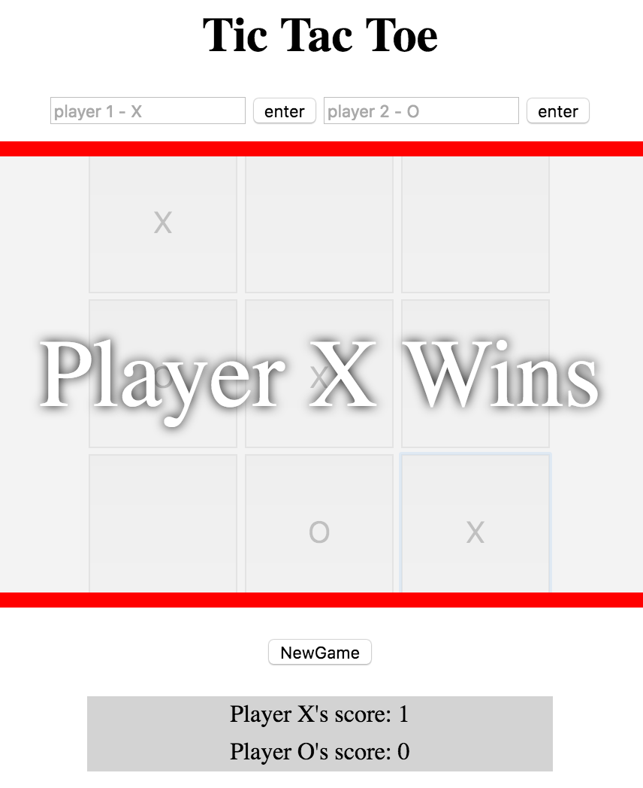
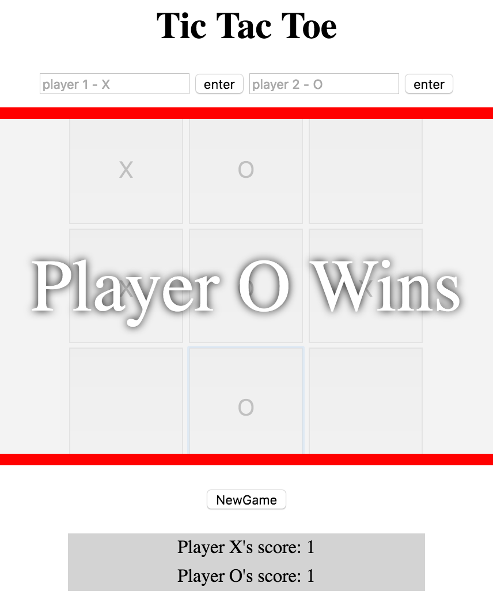
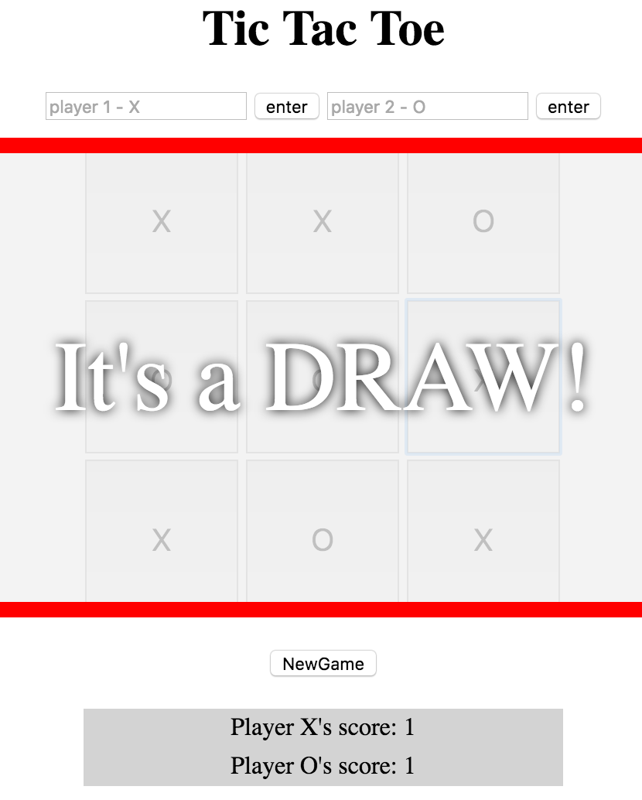
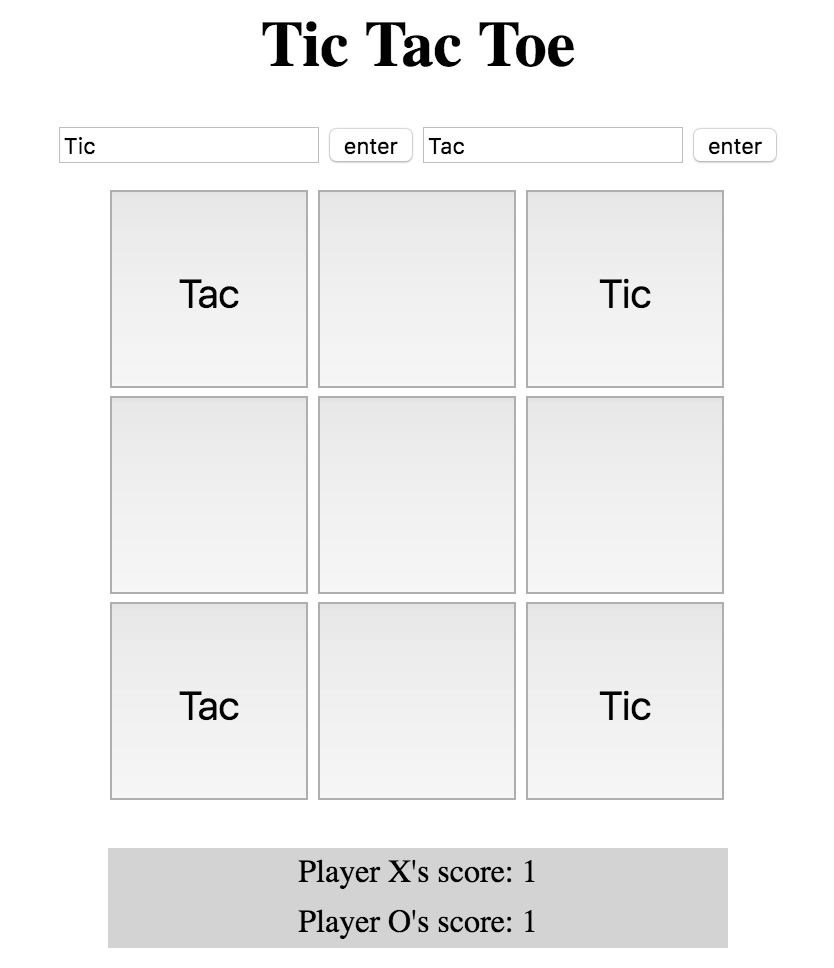

# Project-0 : Tic Tac Toe

Working version of the game Tic Tac Toe created from scratch. The game includes includes a multiplayer option where 2 players can take turns in battling it out on the board. The first to player to get 3 of their tokens in a line (row, column or diagonal) wins. This version of the game includes extra features such as a win counter, reset game function and even allow for players to change their names and tokens.

An additional AI version of the game, where the player can test their skills to vs an unbeatable AI is on the way.

Example of output for win scenarios :

Example of output for a draw :

### How to change player name / token :

Enter the desired name for each player in the input boxes provided above the board and click the 'enter' button to confirm their names.

Example output of possible name change :

### New game / reset game :

The ability to start a new game / rest the game can be only be acquired after the game has ended. This way players are not able to cheat and reset the game from making a wrong move, instead they must learn from their mistakes in the next round.

Notice in the above 'name change' image the New Game button doesn't appear until round is over.

Enjoy and have fun!
